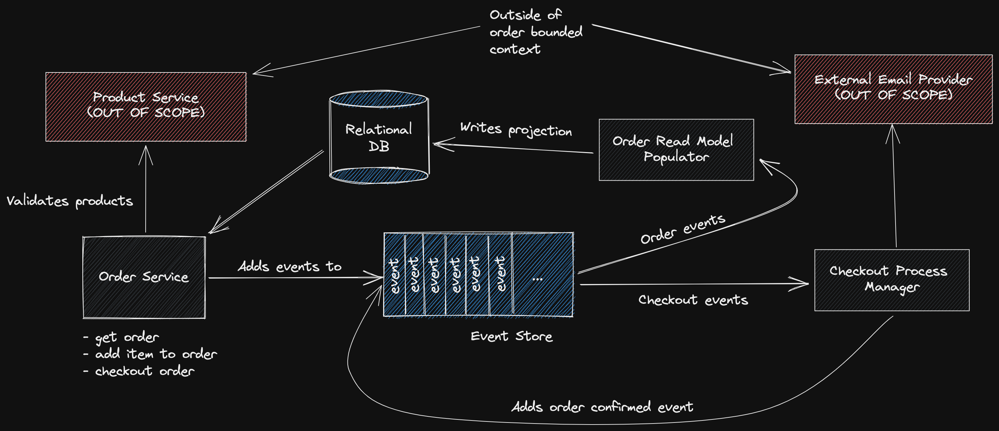

# Event Sourced Ecommerce System

An event sourced ecommerce system for learning and development.

Project status: **backend working! frontend still in progress**.

**STACK: TypeScript, Node.js, React, Postgres, Docker, Vite, ESBuild Flyway.**

**IMPORTANT:** The way I've written this system is not necessarily indicative of what I think is the _best way_ to solve this problem.
I've tried a few paradigms, techniques and tools (e.g. a bit more Object Orientated instead of Functional) for the sake of learning and example.
Each of these decisions obviously carry tradeoffs with it.

## Project Goals

-   Create an order
-   Add an item to order
-   Checkout an order
-   View order

## Out of Scope

I have made the following out of scope for this project to keep things simple:

-   Item quantities (orders can have multiple items but with quantity 1)
-   Removing items from order
-   Sending emails (use a mock)
-   Product bounded context e.g. product service (use a mock)
-   API authentication & authorization
-   User specific stuff e.g. orders won't have a customer id attached
-   Handling product price changes (e.g. concurrently setting the price while a customer checks out)
-   An Order read model process (I've just used the aggregate instead)

## How to run locally

Run everything in Docker:

```sh
./scripts/run.sh
```

Or run locally with hot reload:

```sh
./scripts/develop.sh
cd services
npm run watch:<SERIVCE_NAME>
```

Each service has a `watch` command defined in the `package.json`.
Run each of these watch commands in a different terminal to get hot reloading.

## Services Overview

-   **Order Service**: A web API responsible for creating, adding items to, viewing and checking out orders.
-   **Order UI**: A React frontend application for the order service, allows users to interact with the system.
-   **Checkout Process Manager**: A process manager responsible for executing the checkout flow when orders are checked out.



## Project Structure

```sh
client/             # The React Order UI
    package.json
    ...
docs/               # Documentation and diagrams
    ...
mocks/              # Mocked services (e.g. product bounded context)
    ...
postman/            # Postman collections
    ...
services/           # Backend services code
    package.json
    pkg/            # Code shared between all backend services
    order-service/  # Entrypoint for the order service
        main.ts
        config.ts
        Dockerfile
        ...
    checkout-pm/    # Entrypoint for the checkout process manager
        main.ts
        config.ts
        Dockerfile
        ...
    ...
README.md           # File you're reading now
```

## Further Reading

-   [Order events overview](./docs/events.md)
-   [Client overview](./client/README.md)
-   [Product service mock](./mocks/product-service/README.md)

## Quick links

Not farmiliar with the structure of this project?
Here's some quick links to jump to the interesting stuff:

-   [Order service express app](./services/order-service/app.ts) (a good starting point)
-   [Order service](./services/pkg/domain/order/order-service.ts)
-   [Order aggregate](./services/pkg/domain/order/order.ts)
-   [Order HTTP controller](./services/pkg/http/controllers/order-controller.ts)
-   [Order events](./services/pkg/domain/order/order-events.ts)
-   [Postgres eventstore](./services/pkg/data/postgres/pg-event-store.ts)
