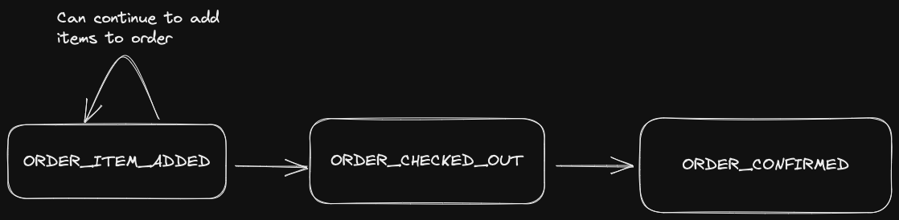

# Events

status: **DRAFT**

This document outlines all the events written in this system.

## The Order Base Event

```jsonc
{
    "streamId": "<ORDER_UUID>",
    "streamType": "ORDER_FLOW",
    "version": 1,
    "eventType": "<EVENT_TYPE>",
    "payload": {...}
}
```

All order events will have a `streamType` of `ORDER_FLOW`.
Even though these events are stored inside the order bounded context, having a `streamType` allows us to add different events in the future that might be outside the normal order flow [listed below](#order-event-flow) but still relating to orders.

The stream ID will be the unique order UUID for the order.
This will ensure streams are short lived and don't contain too many events.

The version field is a simple incrementing counter that acts as an optimistic concurrency control and also ensures proper ordering of events.

## Item Added Event Payload

```jsonc
{
    ...
    "eventType": "ORDER_ITEM_ADDED",
    "payload": {
        "itemId": "<ITEM_UUID>",
    },
}
```

Adds item at the current price to the order.

## Order Checked Out Event Payload

```jsonc
{
    ...
    "eventType": "ORDER_CHECKED_OUT",
    "payload": {
        "totalPrice": 25.0
    },
}
```

Marks an order as checked out.
Confirms the final total price of the order.
After this event, any `ORDER_ITEM_ADDED` events will fail.

**Known issue**: The total price is computed from querying the product service.
If the product's price changes just after the checkout request is sent but _before_ this event is created, a user will be charged a price they did not see.
This is out of scope for this project but feel free to ask me how I'd solve it.

## Order Confirmed Event Payload

```jsonc
{
    ...
    "eventType": "ORDER_CONFIRMED",
    "payload": {
        /* Empty payload */
    },
}
```

Marks an order as confirmed.
This event signals the completion of the checkout flow.

## The Order Flow


